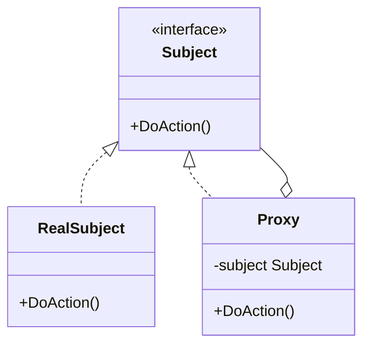

import Tabs from "@theme/Tabs";
import TabItem from "@theme/TabItem";

# 模板模式
:::tip
模板模式：代理和被代理的对象实现了相同的接口，注意接口承担了所有的抽象
:::

## 思路讲解



以下是你的 Go 代码的类图，用 Mermaid 格式表示：


- `Subject` 是一个接口，定义了 `DoAction` 方法。
- `RealSubject` 实现了 `Subject` 接口，并定义了 `DoAction` 方法的具体操作。
- `Proxy` 也实现了 `Subject` 接口，但其 `DoAction` 方法包含了额外的逻辑，并代理 `RealSubject` 的 `DoAction` 方法。
- `Proxy` 包含一个 `Subject` 类型的成员变量 `subject`，用于保存被代理的 `RealSubject` 实例。
- 类图中箭头表示继承关系和关联关系：
  - `Subject <|.. RealSubject` 和 `Subject <|.. Proxy` 表示 `RealSubject` 和 `Proxy` 实现了 `Subject` 接口。
  - `Proxy o-- Subject` 表示 `Proxy` 持有一个 `Subject` 的实例。

通过这个类图，可以清晰地看到代理模式的结构以及各个类之间的关系。
## 代码实现

<Tabs>
    <TabItem value="golang" label="Golang">

        ```go showLineNumbers {6,22-24}
        package main

        import "fmt"

        //接口
        type AbstractTemplate interface {
            method1()
            method2()
            method3()
        }
        //---------------------------------

        //实现：ConcreteTemplate实现了AbstractTemplate所有方法
        type ConcreteTemplate struct {
            template //继承父类模板，这样初始化的时候才能在
        }

        func (c *ConcreteTemplate) method1() {
            fmt.Println("method1")
        }

        func (c *ConcreteTemplate) method2() {
            fmt.Println("method2")
        }

        func (c *ConcreteTemplate) method3() {
            fmt.Println("method3")
        }

        //依赖于抽象而不依赖于具体
        type template struct {
            b AbstractTemplate
        }

        func (t *template) TemplateMethod () {
            t.b.method1()
            t.b.method2()
            t.b.method3() 
        }

        //构造函数
        func newConcreteTemplate() *ConcreteTemplate {
            c := &ConcreteTemplate{}
            c.b = c
            return c
        }

        func main() {
            a := newConcreteTemplate()
            a.TemplateMethod()
        }
        ```

    </TabItem>
    <TabItem value="ts" label="TypeScript">

        ```ts
        //无内容
        var a = 1;
        ```

    </TabItem>
</Tabs>


