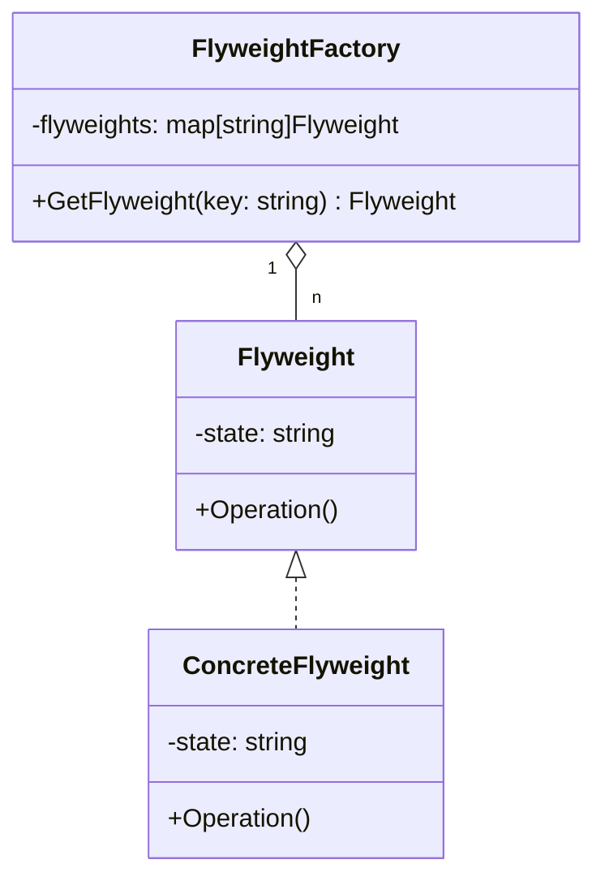

# 享元模式 E 
这段Go语言代码实现了享元模式（Flyweight Pattern），它是一种结构型设计模式，用于减少创建相似对象的数量，通过共享它们来减少内存使用和提高效率。以下是根据你的代码绘制的类图：

:::tip
哈希表
:::

在这个类图中：
- `Flyweight` 是一个接口，定义了享元对象必须实现的 `Operation` 方法。
- `ConcreteFlyweight` 是 `Flyweight` 接口的具体实现，拥有一个 `state` 属性，并实现了 `Operation` 方法。
- `FlyweightFactory` 是享元工厂，它维护了一个 `flyweights` 映射，用于存储和管理享元对象。它有一个 `GetFlyweight` 方法，用于获取或创建享元对象。

请注意，这个类图是根据你提供的Go代码逻辑绘制的，它展示了类之间的关系和方法的实现。在实际的UML类图中，接口通常会用虚线来表示，但在这里为了简化，我们没有使用虚线。

