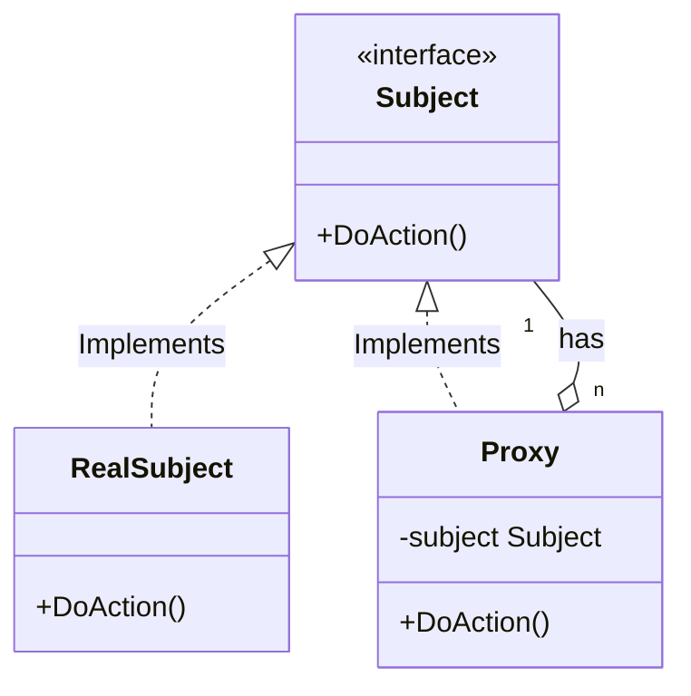

import Tabs from "@theme/Tabs";
import TabItem from "@theme/TabItem";

# 代理模式 E
:::tip
考试不想考，我让双胞胎哥哥替我考试，哥哥是我的代理
:::

1. 目的：为另一个对象提供一个代替或占位符以控制对它的访问。代理可以在不直接访问实际对象的情况下，提供对实际对象的间接访问。
2. 实现：代理对象充当原对象的接口，并且包含对实际对象的引用。代理可以在将请求转发给实际对象之前或之后，执行额外的操作，如访问控制、延迟初始化、日志记录等。
3. 场景：当需要控制对原始对象的访问，或者在访问原始对象之前或之后需要执行某些操作时。

## 思路讲解



以下是你的 Go 代码的类图，用 Mermaid 格式表示：


- `Subject` 是一个接口，定义了 `DoAction` 方法。
- `RealSubject` 实现了 `Subject` 接口，并定义了 `DoAction` 方法的具体操作。
- `Proxy` 也实现了 `Subject` 接口，但其 `DoAction` 方法包含了额外的逻辑，并代理 `RealSubject` 的 `DoAction` 方法。
- `Proxy` 包含一个 `Subject` 类型的成员变量 `subject`，用于保存被代理的 `RealSubject` 实例。
- 类图中箭头表示继承关系和关联关系：
  - `Subject <|.. RealSubject` 和 `Subject <|.. Proxy` 表示 `RealSubject` 和 `Proxy` 实现了 `Subject` 接口。
  - `Proxy o-- Subject` 表示 `Proxy` 持有一个 `Subject` 的实例。

通过这个类图，可以清晰地看到代理模式的结构以及各个类之间的关系。

## 模式区分
1. 


## 代码实现

<Tabs>
    <TabItem value="golang" label="Golang">

        ```go showLineNumbers {6,22-24}
        package main

        import "fmt"

        type Subject interface {
            DoAction() //注意 Proxy 和 被Proxy代理的对象都实现了同一个 DoAction 接口
        }

        //代理模式
        //-----------------真实操作-----------------
        type RealSubject struct {}

        func (r *RealSubject) DoAction() {
            fmt.Println("执行真实操作")
        }
        //-----------------代理操作-----------------
        type Proxy struct {
            subject Subject
        }

        func (p *Proxy) DoAction() {
            fmt.Println("开始执行代理") //代理模式的额外动作
            p.subject.DoAction()
            fmt.Println("代理执行结束") //代理模式的额外动作
        }

        func main() {
            proxy := &Proxy{subject: &RealSubject{}}
            proxy.DoAction()
        }
        ```

    </TabItem>
    <TabItem value="ts" label="TypeScript">

        ```ts
        
        ```

    </TabItem>
</Tabs>


