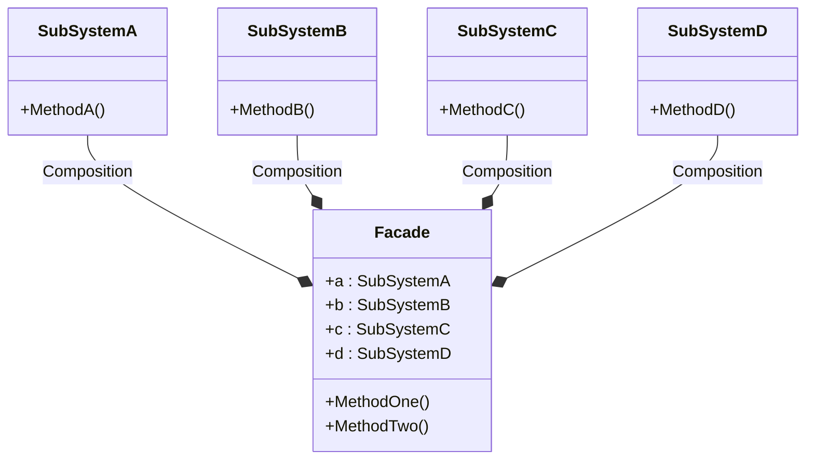

# 外观模式 E

:::tip
讲多个实体的方法结合起来使用
:::
在Mermaid的类图语法中，组合（Composition）关系使用一个带有实心圆点的实线箭头来表示。组合意味着“拥有”关系，并且被拥有的对象（成员对象）的生命周期依赖于拥有者（容器对象）。如果拥有者被销毁，成员对象也会被销毁。

以下是使用Mermaid语法表示组合关系的示例：

在这个示例中，`SubSystemA`, `SubSystemB`, `SubSystemC`, 和 `SubSystemD` 都与 `Facade` 有组合关系。这表示 `Facade` 拥有这些子系统，并且这些子系统是作为 `Facade` 的一部分存在的。注意，实际的Go语言代码中并没有表现出组合关系，因为Go语言不支持类的组合。这里的Mermaid类图只是为了演示组合关系的表示方法。
