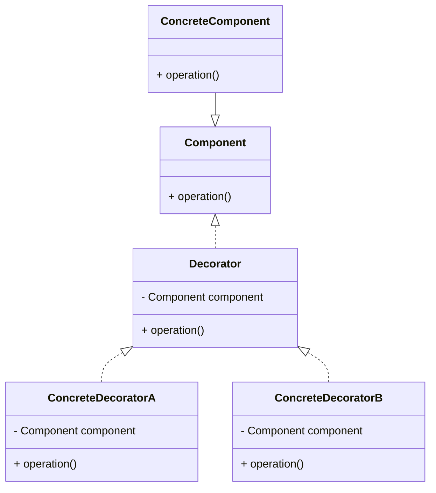

# 装饰模式 H

:::tip
被装饰过的仍然可以继续被装饰，注意装饰器和被装饰器实现了相同的接口
:::

装饰器模式是一种结构型设计模式，它允许用户在不修改对象本身的情况下动态地给单个对象添加职责。这种模式通过创建一个包装对象，也就是装饰器，来包裹实际对象。以下是使用Mermaid语法描述的装饰器模式的UML类图：

[装饰器模式](https://blog.csdn.net/qq_42937522/article/details/104986306)

在这个类图中：
- `Component` 是定义了对象接口的抽象类，可以是接口或抽象类。
- `ConcreteComponent` 是实现了 `Component` 接口的具体类。
- `Decorator` 是定义了装饰器的抽象类，它持有一个 `Component` 类型的成员变量，并实现了 `Component` 接口。
- `ConcreteDecoratorA` 和 `ConcreteDecoratorB` 是具体的装饰器类，它们继承自 `Decorator` 类，并添加了额外的行为。

`ConcreteComponent` 直接实现了 `Component` 接口，而 `ConcreteDecoratorA` 和 `ConcreteDecoratorB` 通过继承 `Decorator` 类间接实现了 `Component` 接口。这样，装饰器可以动态地添加到具体组件上，而不需要修改组件的代码。

装饰器模式允许用户通过组合装饰器来扩展对象的功能，同时保持对象的灵活性和可扩展性。
