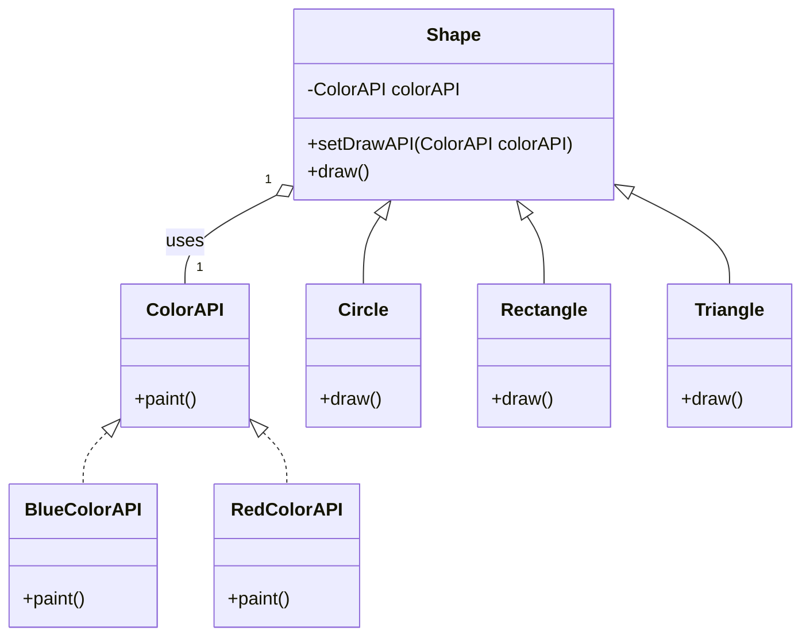

# 桥接模式 M
以下是使用Mermaid语法描述桥接模式的UML类图：

:::tip
当实体设计多个维度的变化，让一个维度包含其他的所有维度 
:::

[桥接模式](https://blog.csdn.net/weixin_39296283/article/details/104953668)

在这个图中：

- `Implementor` 是一个接口，定义了实现部分的接口，其中包含一个 `operation` 方法。
- `ConcreteImplementorA` 是 `Implementor` 接口的一个具体实现类。
- `Abstraction` 是一个抽象类，定义了抽象部分的接口，包含一个指向 `Implementor` 类型的成员变量 `implementor`，和一个抽象方法 `executeOperation`。
- `RefinedAbstraction` 是 `Abstraction` 的具体实现，继承自 `Abstraction` 并实现了 `executeOperation` 方法。
- `Abstraction` 类与 `Implementor` 接口之间存在一个组合关系，表示 `Abstraction` 类持有一个 `Implementor` 的实例。
- `RefinedAbstraction` 实现了 `Abstraction` 的抽象方法，展示了桥接模式中抽象与实现的分离。
