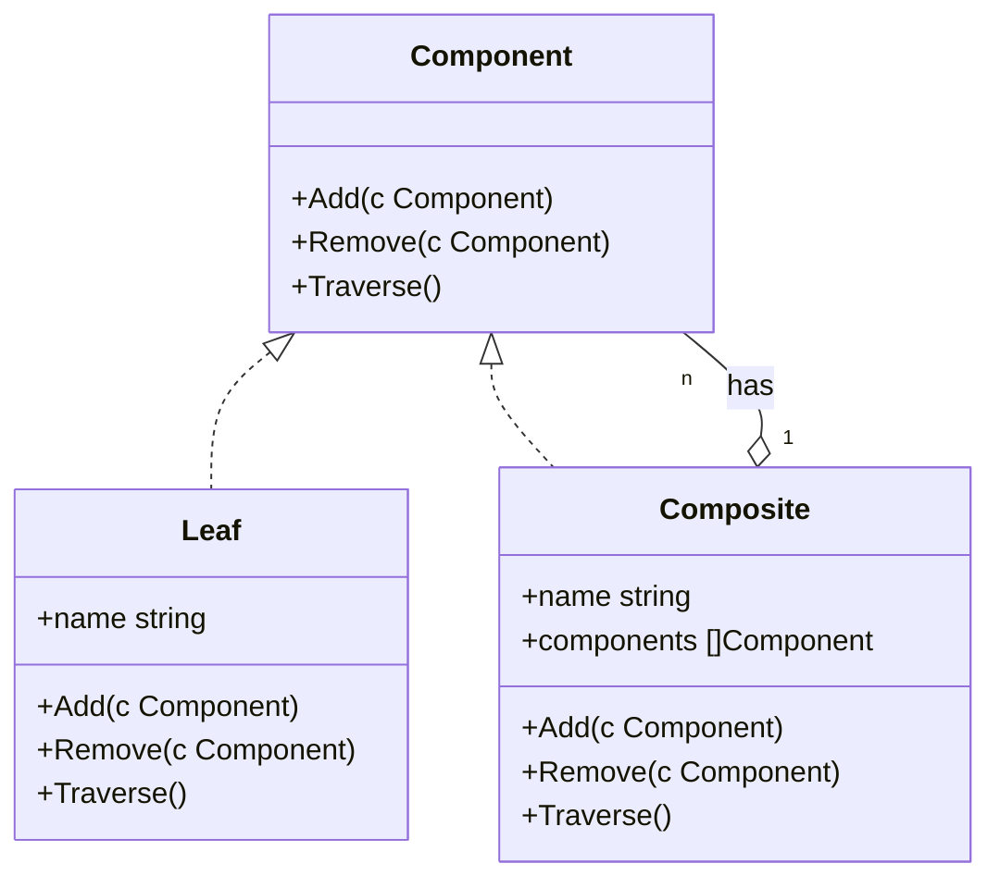

# 组合模式 E

:::tip
树中每个节点都是一致的
:::

以下是根据你提供的组合模式（Composite Pattern）的Go代码绘制的Mermaid类图：

在这个类图中：

- `Component` 是一个接口，定义了组合模式中所有对象必须实现的操作，包括 `Add`、`Remove` 和 `Traverse` 方法。
- `Leaf` 是叶子节点，实现了 `Component` 接口。叶子节点不包含子节点，因此其 `Add` 和 `Remove` 方法会打印一条不支持操作的信息。
- `Composite` 是组合节点，也实现了 `Component` 接口。它可以包含子节点（`components` 数组），并实现了 `Add` 和 `Remove` 方法来管理这些子节点。`Traverse` 方法用于遍历所有子节点。
- `Composite` 与 `Component` 之间存在一对多的关系，表示一个组合节点可以包含多个组件。

请注意，Mermaid 类图语法中的 `-o` 表示一个组合节点可以包含多个组件，而 `--` 表示实现接口的关系。`"1"` 和 `"0..*"` 分别表示组合节点和组件之间的数量关系，即一个组合节点可以包含零个或多个组件。
