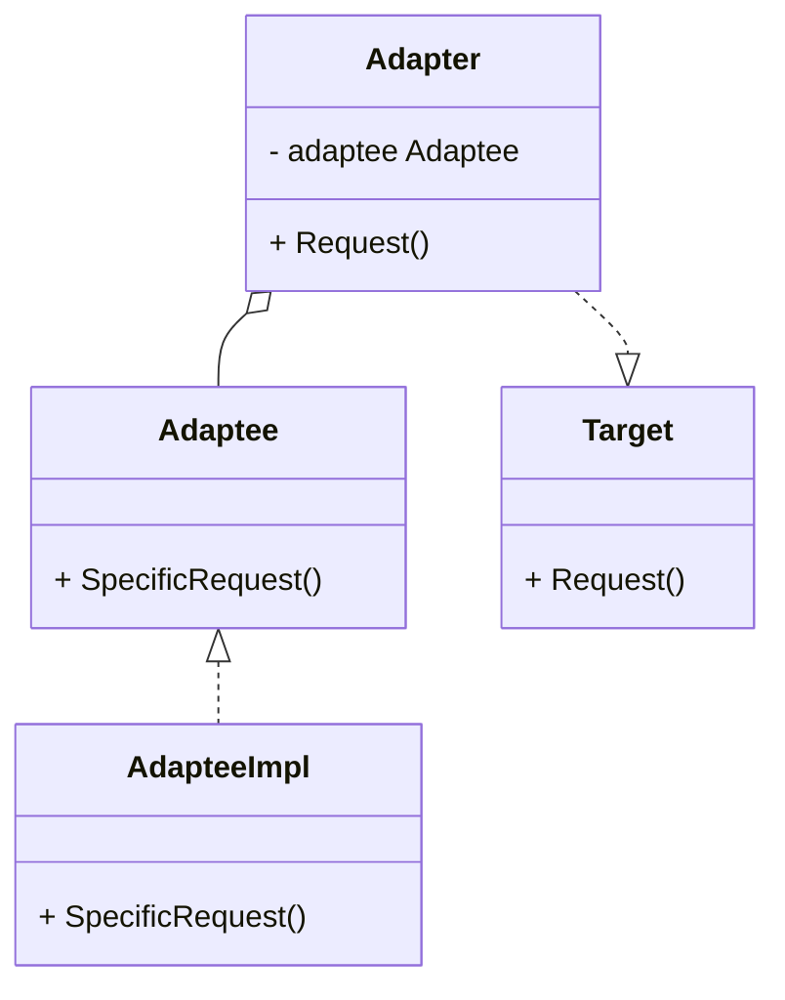

# 适配器模式 E
:::tip
没有什么是加一层解决不了的
:::
## 概念
适配器模式（Adapter Pattern）是一种结构型设计模式，它允许不兼容的接口之间进行交互。以下是使用Mermaid语法描述的适配器模式的UML类图：

在这个类图中：
- `Adaptee` 是一个接口，定义了需要被适配的特定请求方法 `SpecificRequest`。
- `AdapteeImpl` 是实现了 `Adaptee` 接口的具体类。
- `Target` 是一个接口，定义了客户端使用的一般请求方法 `Request`。
- `Adapter` 是适配器类，它实现了 `Target` 接口，并且持有 `Adaptee` 类型的成员变量。适配器通过将 `Adaptee` 的特定请求转换为 `Target` 的一般请求，使得客户端可以与不兼容的接口进行交互。

`Adapter` 类中的 `Request` 方法调用 `adaptee` 的 `SpecificRequest` 方法，从而实现了接口的转换。

请注意，Mermaid类图的语法需要在支持Mermaid渲染的环境中使用。上面的Go语言代码示例演示了如何实现适配器模式，通过适配器类将一个不兼容的接口转换为客户端期望的接口。

## 区分
1. 代理模式：proxy 和 被代理的对象实现了相同接口，适配器不需要实现相同接口

## 代码